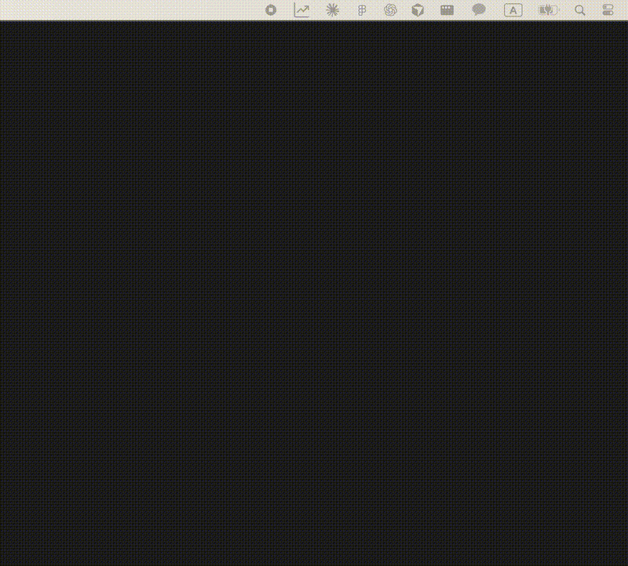

# Maantano Ticker

<div align="center">

**macOS 메뉴바에서 한국 및 미국 주식 실시간 시세를 확인하는 앱**


[](https://github.com/maantano/homebrew-maantano)

</div>

## 📱 소개

Maantano Ticker는 macOS 메뉴바에 실시간 주식 시세를 표시하는 경량 데스크톱 앱입니다. 한국(네이버 증권 API) 및 미국(Yahoo Finance API) 주식을 모두 지원하며, 깔끔한 UI와 편리한 기능으로 주식 투자자들의 모니터링을 돕습니다.

> **⚠️ 주의**: 메뉴바에 위젯이 너무 많거나, 텍스트 크기가 메뉴바보다 클 경우 정보가 잘려서 보이지 않을 수 있습니다. 이 경우 설정에서 텍스트 크기를 줄이거나 다른 메뉴바 위젯을 제거해주세요.

## 🎬 데모

<div align="center">



</div>

### 기능

- 🌏 **다중 시장 지원**: 한국 주식(KOSPI/KOSDAQ) 및 미국 주식(NASDAQ/NYSE/AMEX) 동시 지원
- 📊 **실시간 시세 조회**: 네이버 증권 + Yahoo Finance API를 통한 실시간 주가 데이터
- 🖥️ **메뉴바 통합**: macOS 메뉴바에 첫 번째 종목의 현재가, 등락률 표시
- 🎨 **색상 커스터마이징**: 메뉴바 텍스트 색상을 10가지 컬러로 변경 가능
- 📏 **텍스트 크기 조절**: Tiny, Small, Medium, Large 4가지 크기 옵션
- 📈 **다중 종목 관리**: 여러 종목을 동시에 추적 및 관리
- 🔍 **스마트 검색**: 종목명/코드 자동완성 검색
  - 한국: 코스피/코스닥 4,000+ 종목
  - 미국: 주요 100+ 종목 (AAPL, MSFT, TSLA 등)
- ⏱️ **자동 업데이트**: 5초 간격 자동 시세 갱신
- 🕐 **거래 시간 지원**:
  - 한국: 정규장 09:00-15:30, 시간외 단일가 08:30-09:00, 시간외 종가 15:40-18:00
  - 미국: 정규장 09:30-16:00 (EST/EDT)

## 🚀 시작하기

### 요구사항

- macOS 10.14 (Mojave) 이상
- Node.js 20.x 이상

### 다운로드 및 설치

#### Homebrew로 설치 (권장)

**가장 간편한 방법입니다.** Gatekeeper 경고 없이 바로 실행됩니다.

```bash
# 설치
brew install --cask --no-quarantine maantano/maantano/maantano-ticker

# 업그레이드
brew upgrade --cask maantano-ticker

# 삭제
brew uninstall --cask maantano-ticker
```

#### 소스에서 빌드

```bash
# 저장소 클론
git clone https://github.com/YOUR_USERNAME/maantano-ticker.git
cd maantano-ticker

# 의존성 설치
npm install

# 개발 모드로 실행
npm run dev

# 프로덕션 빌드
npm run build
```

빌드된 앱은 `dist/` 폴더에 생성됩니다.

## 📖 사용법

### 첫 실행

1. 앱을 실행하면 메뉴바에 차트 아이콘이 표시됩니다
2. 아이콘을 클릭하여 메인 창을 엽니다
3. 환영 메시지를 확인하고 "확인" 버튼을 클릭합니다

### 종목 추가

1. 메인 창에서 **"+ 종목 추가"** 버튼 클릭
2. 검색창에 종목명 또는 코드 입력 (예: "삼성전자", "005930")
3. 자동완성 목록에서 원하는 종목 선택
4. 종목이 리스트에 추가됨

### 종목 관리

- **순서 변경**: 종목을 드래그 앤 드롭으로 이동
- **종목 삭제**: 각 종목 우측의 "삭제" 버튼 클릭
- **수동 업데이트**: 하단의 새로고침 버튼 클릭

### 메뉴바 색상 변경

1. 하단의 설정(⚙️) 버튼 클릭
2. "텍스트 색상" 섹션에서 원하는 색상 선택
3. 메뉴바 텍스트 색상이 즉시 변경됨

### 기술 스택

**프론트엔드**

- Electron 28.x - 데스크톱 앱 프레임워크
- Vanilla JavaScript - UI 로직
- CSS3 - 스타일링

**백엔드**

- Node.js - 런타임
- axios - HTTP 요청
- cheerio - HTML 파싱 (웹 스크래핑)
- canvas - 메뉴바 아이콘 렌더링
- electron-store - 로컬 데이터 저장

**개발 도구**

- electron-builder - 앱 빌드 및 패키징
- standard-version - 자동 버전 관리
- GitHub Actions - CI/CD 자동화

## 📝 버전 관리 및 배포

이 프로젝트는 [Semantic Versioning](https://semver.org/)과 [Conventional Commits](https://www.conventionalcommits.org/)를 따릅니다.

자세한 릴리스 프로세스는 [RELEASE.md](./RELEASE.md)를 참조하세요.

## ⚠️ 면책 조항 및 주의사항

### 데이터 정확성

- 제공되는 주식 시세 데이터의 정확성을 보장하지 않습니다
- 이 데이터를 바탕으로 한 투자 결정에 대한 책임은 전적으로 사용자에게 있습니다
- **투자 손실에 대해 개발자는 어떠한 책임도 지지 않습니다**

### 사용 제한

- 과도한 API 요청으로 인한 IP 차단 가능성이 있습니다
- 개인적인 용도로만 사용하시기 바랍니다
- 상업적 사용 또는 대량 배포 시 네이버 측에서 법적 조치를 취할 수 있습니다
- 네이버 금융의 robots.txt 및 이용약관을 준수해야 합니다

**이 앱을 다운로드하거나 사용함으로써, 위의 모든 조항에 동의하는 것으로 간주됩니다.**

## 📄 라이선스

이 프로젝트는 MIT 라이선스 하에 배포됩니다. 자세한 내용은 [LICENSE](./LICENSE) 파일을 참조하세요.

**단, 네이버 금융 데이터의 저작권은 네이버에 있으며, 이 라이선스는 해당 데이터에 적용되지 않습니다.**

## 🙏 Credits

- 차트 아이콘: [Freepik - Flaticon](https://www.flaticon.com/kr/free-icons/)
- 뒤로 화살표 아이콘: [Andrean Prabowo - Flaticon](https://www.flaticon.com/kr/free-icons/-)
- 주식 데이터: 네이버 금융

## 💬 문의 및 지원

- 버그 리포트: [Issues](../../issues)
- 기능 요청: [Issues](../../issues)
- 문의: contact@maantano-ticker.com

---

<div align="center">

**Maantano Ticker**로 더 스마트한 투자 모니터링을 경험하세요!

⭐ 이 프로젝트가 도움이 되셨다면 Star를 눌러주세요!

</div>
